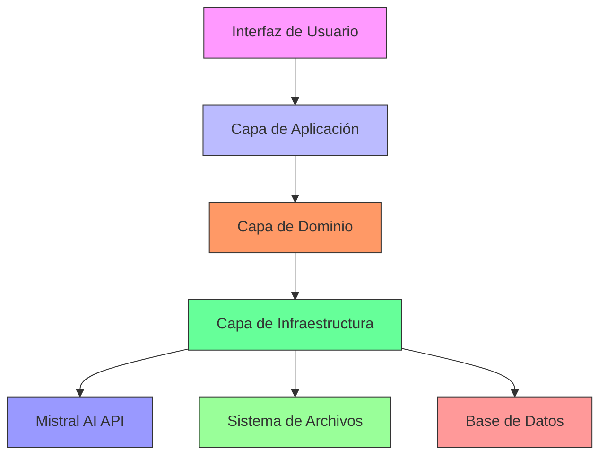
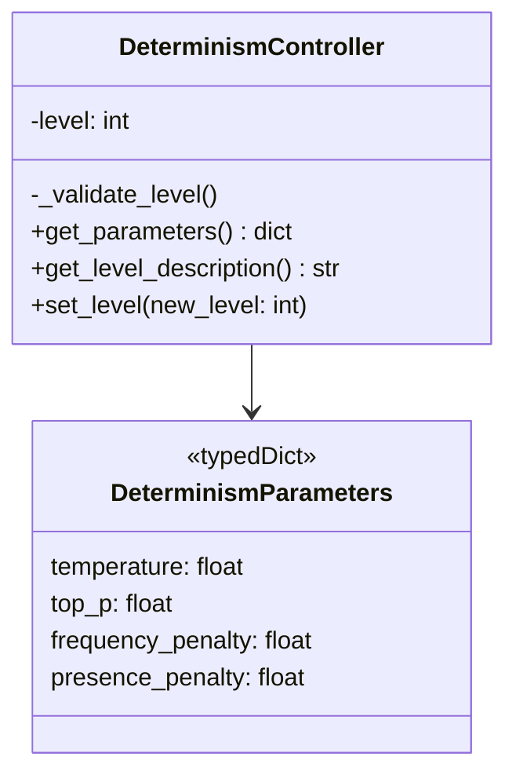
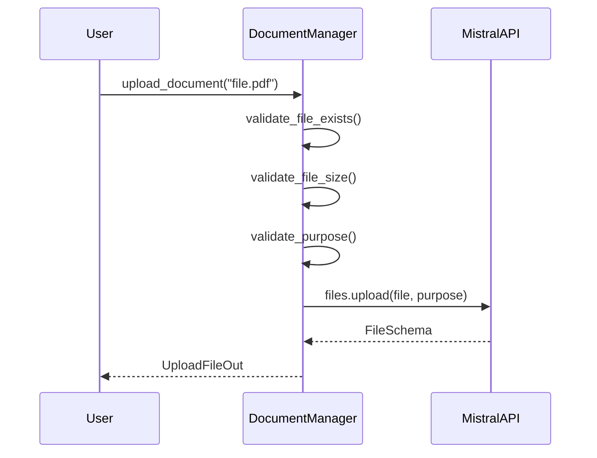
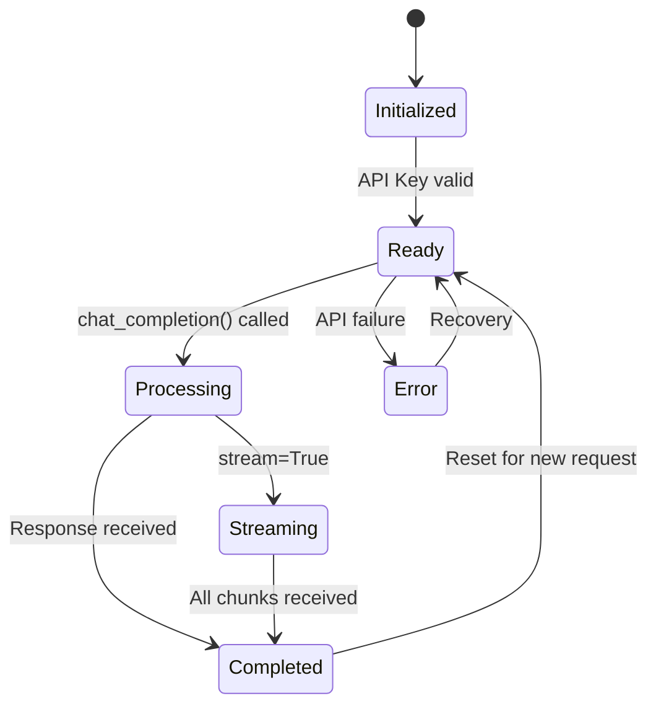
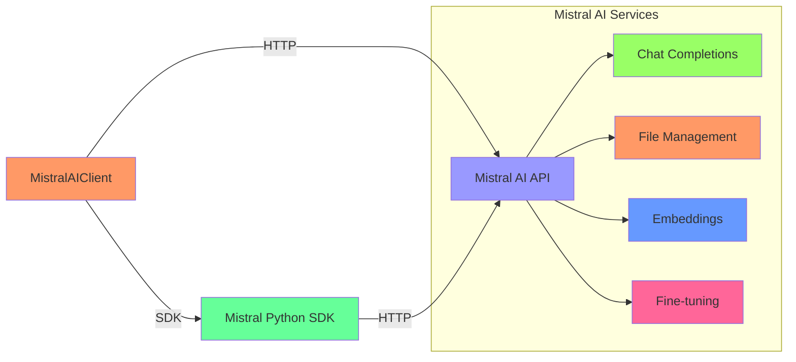
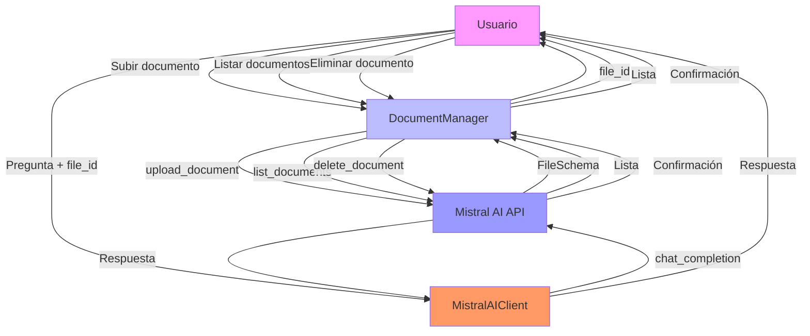
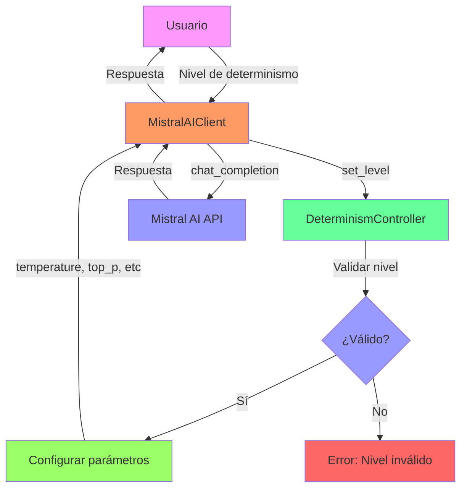
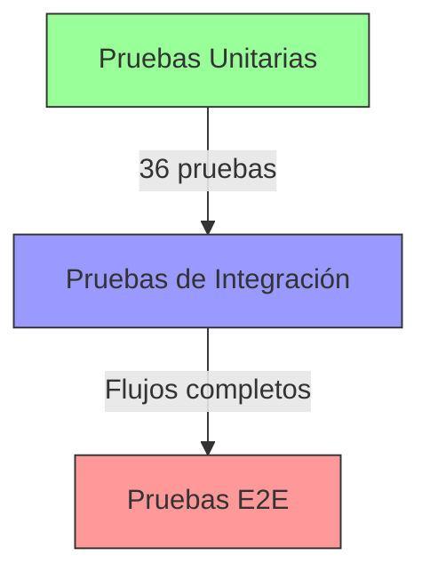
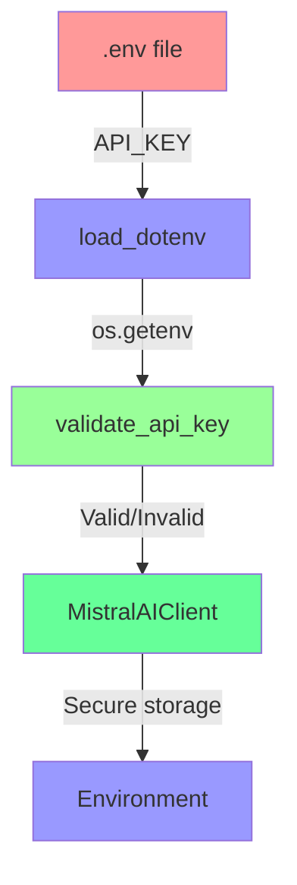
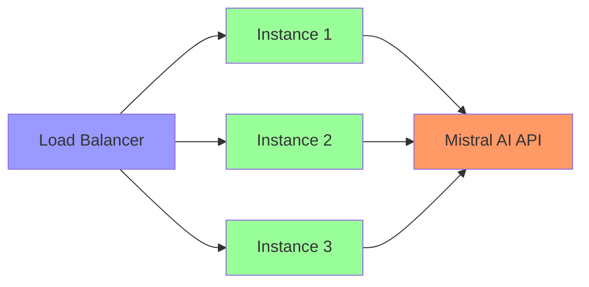

# 🏗️ Arquitectura del Sistema Mistral AI Tests

## 📐 Visión General de la Arquitectura

El sistema sigue una arquitectura modular y escalable basada en el patrón de diseño **Layered Architecture** con elementos de **Clean Architecture**. Está diseñado para ser mantenible, probable y fácil de extender.



## 🏗️ Capas de la Arquitectura

### 1. Capa de Interfaz (Presentation Layer)

**Responsabilidad**: Interacción con el usuario y presentación de resultados

**Componentes:**
- `src/example_determinism.py` - Ejemplo de determinismo
- `src/example_document_qna.py` - Ejemplo de Document QnA
- `main_examples.py` - Menú principal

**Tecnologías:**
- Python CLI
- Text formatting
- User input handling

### 2. Capa de Aplicación (Application Layer)

**Responsabilidad**: Coordinación de flujos de trabajo y lógica de negocio

**Componentes:**
- `src/mistral_client.py` - Cliente principal
- `src/document_manager.py` - Gestión de documentos
- `src/determinism_controller.py` - Control de determinismo

**Tecnologías:**
- Python classes
- Dependency injection
- Error handling

### 3. Capa de Dominio (Domain Layer)

**Responsabilidad**: Lógica de negocio central y reglas

**Componentes:**
- `DeterminismController` - Lógica de determinismo
- `DocumentManager` - Reglas de gestión de documentos
- `MistralAIClient` - Lógica de interacción con API

**Tecnologías:**
- Python pure functions
- Business rules
- Domain models

### 4. Capa de Infraestructura (Infrastructure Layer)

**Responsabilidad**: Integración con sistemas externos

**Componentes:**
- Mistral AI API client
- File system operations
- HTTP requests

**Tecnologías:**
- Mistral AI SDK
- HTTPX
- File I/O

## 🔧 Patrones de Diseño

### 1. Strategy Pattern

**Implementación**: `DeterminismController`

```python
class DeterminismController:
    def __init__(self, level: int):
        self.level = level
        self.strategy = self._get_strategy()
    
    def _get_strategy(self):
        if self.level == 1:
            return ExactStrategy()
        elif self.level == 2:
            return FocusedStrategy()
        # ... otros niveles
```

**Beneficios:**
- Fácil de extender con nuevos niveles
- Separación de algoritmos
- Intercambiabilidad en tiempo de ejecución

### 2. Factory Pattern

**Implementación**: Creación de clientes

```python
client = MistralAIClient(
    api_key=api_key,
    model="mistral-large-latest",
    determinism_level=3
)
```

**Beneficios:**
- Configuración flexible
- Inyección de dependencias
- Fácil de probar

### 3. Repository Pattern

**Implementación**: `DocumentManager`

```python
doc_manager = DocumentManager(api_key)
documents = doc_manager.list_documents()
file_info = doc_manager.upload_document("file.pdf")
```

**Beneficios:**
- Abstracción de almacenamiento
- Operaciones CRUD consistentes
- Fácil de mockear en pruebas

### 4. Observer Pattern

**Implementación**: Streaming de respuestas

```python
for chunk in client.chat_completion_stream(messages):
    print(chunk, end="", flush=True)
```

**Beneficios:**
- Procesamiento en tiempo real
- Bajo consumo de memoria
- Respuestas progresivas

## 📦 Módulos Principales

### 1. `determinism_controller.py`

**Diagrama de Clases:**



**Flujos Principales:**
1. Validación de nivel → Configuración de parámetros → Devolución de configuración
2. Cambio de nivel → Revalidación → Actualización de parámetros

### 2. `document_manager.py`

**Diagrama de Secuencia (Subida de Documento):**



**Operaciones CRUD:**
- Create: `upload_document()`
- Read: `list_documents()`, `get_document_info()`
- Update: `get_signed_url()` (genera URL temporal)
- Delete: `delete_document()`

### 3. `mistral_client.py`

**Diagrama de Estados:**



**Métodos Principales:**
- `chat_completion()`: Respuesta completa
- `chat_completion_stream()`: Streaming en tiempo real
- `chat_completion_with_metrics()`: Con métricas de rendimiento
- `list_models()`: Obtener modelos disponibles

## 🔌 Integración con Mistral AI

### Arquitectura de Integración



### Endpoints Utilizados

1. **Chat Completions**: `POST /v1/chat/completions`
   - Mensajes con contexto
   - Streaming opcional
   - Parámetros de determinismo

2. **File Upload**: `POST /v1/files`
   - Subida de documentos
   - Validación de tamaño (max 512MB)
   - Propósito específico (ocr, fine-tune, batch)

3. **File List**: `GET /v1/files`
   - Listado de documentos
   - Paginación
   - Filtros por propósito

4. **File Retrieve**: `GET /v1/files/{file_id}`
   - Información de documento
   - Metadatos
   - Estado

5. **File Delete**: `DELETE /v1/files/{file_id}`
   - Eliminación de documento
   - Confirmación de eliminación

6. **Signed URL**: `GET /v1/files/{file_id}/url`
   - URL temporal (max 24h)
   - Acceso seguro

## 📊 Flujo de Datos

### Document QnA Flow



### Determinism Control Flow



## 🧪 Arquitectura de Pruebas

### Pirámide de Pruebas



### Estrategia de Testing

1. **Pruebas Unitarias** (36 pruebas)
   - Aislamiento completo con mocking
   - Cobertura de todos los métodos públicos
   - Validación de edge cases

2. **Pruebas de Integración**
   - Flujos completos de trabajo
   - Interacción entre módulos
   - Pruebas con archivos reales

3. **Pruebas de Sistema**
   - Ejemplos funcionales
   - Integración con API real
   - Validación de resultados

### Herramientas de Testing

- **pytest**: Framework de pruebas
- **pytest-mock**: Mocking avanzado
- **pytest-cov**: Cobertura de código
- **unittest.mock**: Mocking estándar

## 📈 Métricas y Rendimiento

### Métricas de Calidad

- **Cobertura de código**: 34% global, 79-86% en módulos principales
- **Pruebas pasando**: 36/36 (100%)
- **Tiempo de ejecución**: ~0.8 segundos para todas las pruebas
- **Calidad de código**: A (Ruff), 100% (Black)

### Métricas de Rendimiento

| Operación | Tiempo Promedio | Tokens/s | Uso Típico |
|-----------|----------------|----------|-------------|
| Subida de documento | 2-5 segundos | - | Depende del tamaño |
| Chat completion | 500-2000ms | 20-50 | Respuesta completa |
| Streaming | 10-50ms/chunk | 5-15 | Respuesta progresiva |
| Listar documentos | 100-300ms | - | Operación rápida |
| Eliminar documento | 200-500ms | - | Operación rápida |

## 🛡️ Seguridad

### Manejo de API Keys



### Validación de Entradas

1. **API Key**: Formato y longitud
2. **Nivel de determinismo**: Rango 1-5
3. **Archivos**: Existencia, tamaño (max 512MB), tipo
4. **Modelos**: Validez y disponibilidad
5. **Mensajes**: Formato y contenido

### Manejo de Errores

```python
try:
    # Operación
    result = client.chat_completion(messages)
except ValueError as e:
    # Error de validación
    logger.error(f"Validation error: {e}")
    raise
except RuntimeError as e:
    # Error de ejecución
    logger.error(f"Runtime error: {e}")
    raise
except Exception as e:
    # Error inesperado
    logger.error(f"Unexpected error: {e}")
    raise RuntimeError(f"Operation failed: {e}") from e
```

## 📁 Estructura de Directorios Recomendada

```
project/
├── docs/              # Documentación
├── src/               # Código fuente
│   ├── core/          # Núcleo del sistema
│   ├── services/      # Servicios
│   ├── models/        # Modelos de datos
│   └── utils/         # Utilidades
├── tests/             # Pruebas
│   ├── unit/          # Pruebas unitarias
│   ├── integration/   # Pruebas de integración
│   └── e2e/           # Pruebas end-to-end
├── examples/          # Ejemplos
├── scripts/           # Scripts utilitarios
└── config/            # Configuración
```

## 🚀 Escalabilidad

### Escalabilidad Horizontal



### Escalabilidad Vertical

- **Aumento de recursos**: Más memoria para documentos grandes
- **Optimización**: Cache de respuestas frecuentes
- **Procesamiento por lotes**: Múltiples documentos simultáneos

## 🎯 Conclusión

La arquitectura del sistema Mistral AI Tests está diseñada para ser:

- **✅ Modular**: Componentes independientes y reutilizables
- **✅ Escalable**: Soporte para crecimiento y demanda
- **✅ Mantenible**: Código limpio y bien documentado
- **✅ Probable**: Cobertura completa de pruebas
- **✅ Extensible**: Fácil de añadir nuevas características
- **✅ Segura**: Validación y manejo de errores robusto

Esta arquitectura permite una integración fluida con la API de Mistral AI mientras mantiene la flexibilidad para adaptarse a futuros requisitos y mejoras.