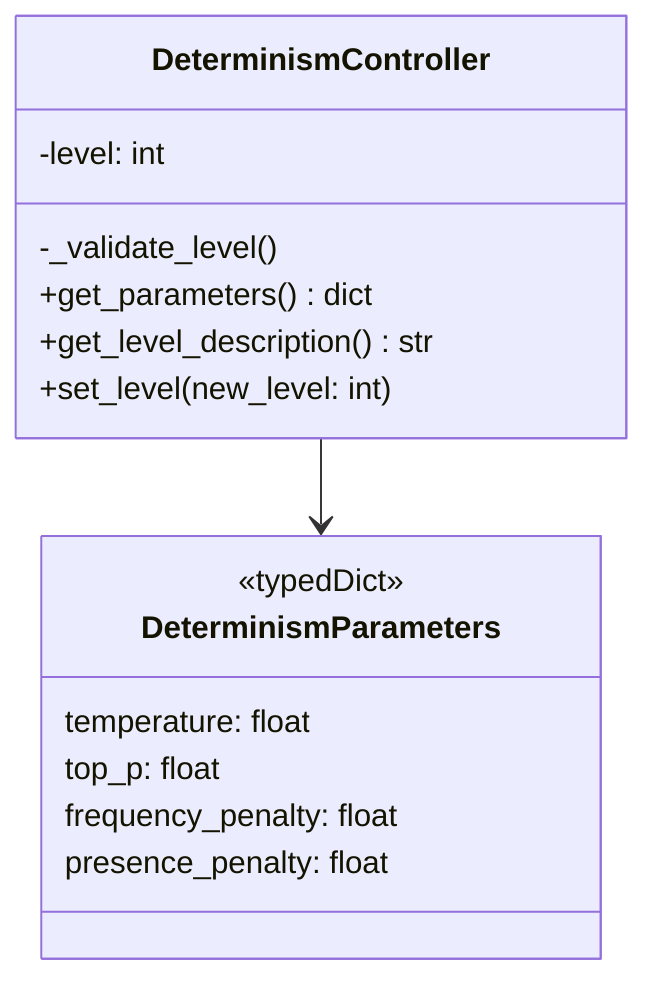
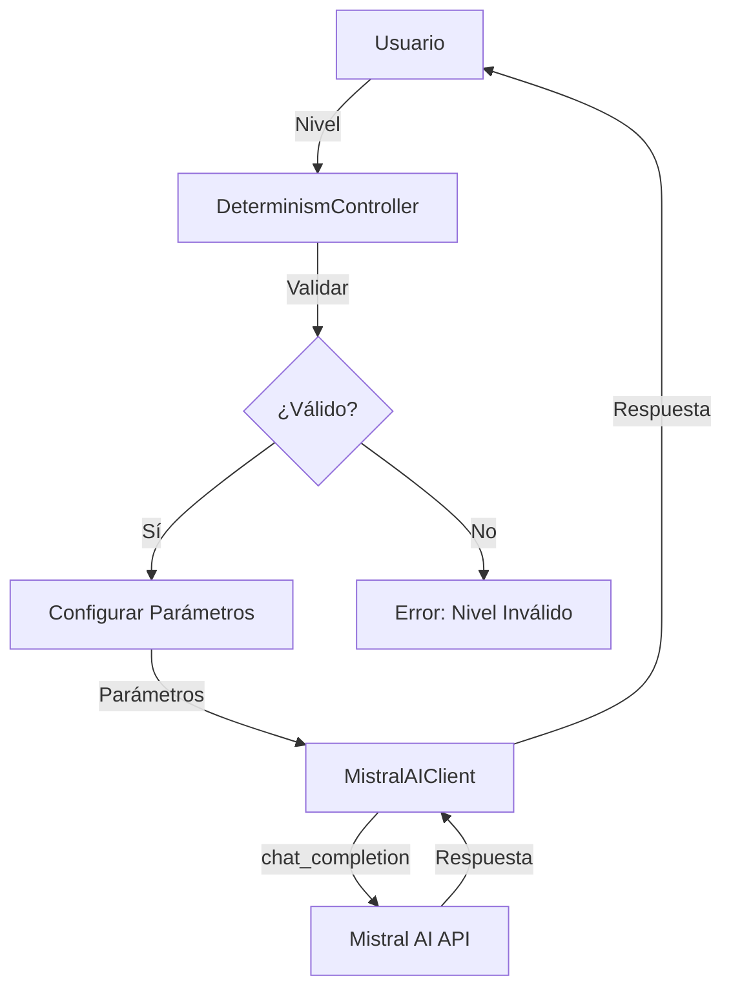

# 🎛️ Guía Completa de Control de Determinismo

## 🎯 ¿Qué es el Control de Determinismo?

El control de determinismo es un sistema que permite ajustar el equilibrio entre **creatividad** y **precisión** en las respuestas de los modelos de lenguaje. Esto se logra mediante la configuración automática de parámetros clave del modelo.

## 📊 Niveles de Determinismo

El sistema implementa **5 niveles de determinismo**, cada uno con configuraciones específicas:

### Nivel 1: Exacto (Mínima Creatividad)

**Descripción**: Respuestas precisas y consistentes con mínima variación.

**Parámetros:**
- Temperatura: 0.1
- Top-P: 0.9
- Frequency Penalty: 0.0
- Presence Penalty: 0.0

**Casos de Uso:**
- Respuestas factuales
- Datos técnicos
- Información que requiere precisión
- Respuestas repetibles

**Ejemplo:**
```python
client = MistralAIClient(api_key=api_key, determinism_level=1)
response = client.chat_completion([
    {"role": "user", "content": "What is the capital of France?"}
])
# Respuesta: "The capital of France is Paris."
```

### Nivel 2: Enfocado (Baja Creatividad)

**Descripción**: Respuestas enfocadas con baja creatividad pero algo de flexibilidad.

**Parámetros:**
- Temperatura: 0.3
- Top-P: 0.9
- Frequency Penalty: 0.1
- Presence Penalty: 0.1

**Casos de Uso:**
- Análisis técnico
- Respuestas estructuradas
- Explicaciones detalladas
- Contenido semi-estructurado

**Ejemplo:**
```python
client = MistralAIClient(api_key=api_key, determinism_level=2)
response = client.chat_completion([
    {"role": "user", "content": "Explain the French Revolution briefly."}
])
```

### Nivel 3: Balanceado (Predeterminado)

**Descripción**: Equilibrio entre precisión y creatividad. Ideal para uso general.

**Parámetros:**
- Temperatura: 0.7
- Top-P: 0.9
- Frequency Penalty: 0.5
- Presence Penalty: 0.5

**Casos de Uso:**
- Conversaciones generales
- Asistentes virtuales
- Respuestas equilibradas
- Uso diario

**Ejemplo:**
```python
client = MistralAIClient(api_key=api_key, determinism_level=3)  # Default
response = client.chat_completion([
    {"role": "user", "content": "Tell me about the Eiffel Tower."}
])
```

### Nivel 4: Creativo (Alta Creatividad)

**Descripción**: Respuestas creativas con mayor variación.

**Parámetros:**
- Temperatura: 0.9
- Top-P: 0.95
- Frequency Penalty: 0.8
- Presence Penalty: 0.8

**Casos de Uso:**
- Generación de contenido
- Brainstorming
- Ideas innovadoras
- Contenido creativo

**Ejemplo:**
```python
client = MistralAIClient(api_key=api_key, determinism_level=4)
response = client.chat_completion([
    {"role": "user", "content": "Write a short poem about Paris."}
])
```

### Nivel 5: Libre (Máxima Creatividad)

**Descripción**: Respuestas altamente creativas con máxima variación.

**Parámetros:**
- Temperatura: 1.0
- Top-P: 1.0
- Frequency Penalty: 1.0
- Presence Penalty: 1.0

**Casos de Uso:**
- Generación artística
- Ideas disruptivas
- Contenido experimental
- Exploración creativa

**Ejemplo:**
```python
client = MistralAIClient(api_key=api_key, determinism_level=5)
response = client.chat_completion([
    {"role": "user", "content": "Imagine a futuristic city."}
])
```

## 📈 Comparación de Niveles

| Nivel | Creatividad | Precisión | Variación | Uso Recomendado |
|-------|-------------|-----------|-----------|-----------------|
| 1 | Baja | Alta | Mínima | Datos factuales |
| 2 | Media-Baja | Alta | Baja | Análisis técnico |
| 3 | Media | Media | Media | Uso general |
| 4 | Media-Alta | Media-Baja | Alta | Generación de contenido |
| 5 | Alta | Baja | Máxima | Creatividad pura |

## 🔧 Implementación Técnica

### Clase DeterminismController

```python
from determinism_controller import DeterminismController

# Crear controlador
controller = DeterminismController(level=3)

# Obtener parámetros
params = controller.get_parameters()
# {'temperature': 0.7, 'top_p': 0.9, 'frequency_penalty': 0.5, 'presence_penalty': 0.5}

# Obtener descripción
description = controller.get_level_description()
# "Balanced - Good mix of creativity and precision"

# Cambiar nivel
controller.set_level(2)
```

### Diagrama de Clases



### Flujo de Control



## 🎨 Ejemplos Prácticos

### 1. Comparación de Respuestas

```python
from mistral_client import MistralAIClient

messages = [{"role": "user", "content": "What is the capital of France?"}]

# Nivel 1: Exacto
client_exact = MistralAIClient(api_key=api_key, determinism_level=1)
response_exact = client_exact.chat_completion(messages)
print(f"Exact (Level 1): {response_exact}")

# Nivel 3: Balanceado
client_balanced = MistralAIClient(api_key=api_key, determinism_level=3)
response_balanced = client_balanced.chat_completion(messages)
print(f"Balanced (Level 3): {response_balanced}")

# Nivel 5: Creativo
client_creative = MistralAIClient(api_key=api_key, determinism_level=5)
response_creative = client_creative.chat_completion(messages)
print(f"Creative (Level 5): {response_creative}")
```

### 2. Cambio Dinámico de Nivel

```python
client = MistralAIClient(api_key=api_key, determinism_level=3)

# Pregunta técnica (nivel 1)
client.determinism_controller.set_level(1)
technical_response = client.chat_completion([
    {"role": "user", "content": "What is the boiling point of water?"}
])

# Pregunta creativa (nivel 5)
client.determinism_controller.set_level(5)
creative_response = client.chat_completion([
    {"role": "user", "content": "Write a haiku about water."}
])
```

### 3. Sobrescritura de Parámetros

```python
client = MistralAIClient(api_key=api_key, determinism_level=3)

# Usar nivel 3 pero con temperatura personalizada
response = client.chat_completion(
    messages,
    temperature=0.9  # Sobrescribe el nivel 3
)
```

## 📊 Impacto en las Respuestas

### Ejemplo: "Describe a cat"

**Nivel 1 (Exacto):**
"A cat is a small carnivorous mammal. It is the only domesticated species in the family Felidae."

**Nivel 3 (Balanceado):**
"A cat is a small, typically furry, carnivorous mammal. They are often kept as house pets and are known for their hunting skills, independence, and playful nature. Cats have been domesticated for thousands of years and come in many breeds and colors."

**Nivel 5 (Creativo):**
"Imagine a creature of elegance and mystery, with eyes that gleam like polished emeralds in the moonlight. The cat, a master of both grace and mischief, moves with the silence of a shadow and the curiosity of an eternal explorer. From the regal Siamese to the cuddly Maine Coon, each feline carries an air of ancient wisdom mixed with playful whimsy. They rule our homes with velvet paws, demanding affection one moment and independence the next. Truly, cats are the enchanting paradoxes of the animal kingdom."

## 🔬 Casos de Uso Avanzados

### 1. Sistema de Soporte Técnico

```python
# Nivel 1 para respuestas precisas
tech_support_client = MistralAIClient(
    api_key=api_key,
    model="mistral-medium-latest",
    determinism_level=1
)

user_question = "How do I reset my password?"
response = tech_support_client.chat_completion([
    {"role": "system", "content": "You are a technical support assistant."},
    {"role": "user", "content": user_question}
])
```

### 2. Generador de Contenido Creativo

```python
# Nivel 5 para máxima creatividad
content_generator = MistralAIClient(
    api_key=api_key,
    model="mistral-large-latest",
    determinism_level=5
)

prompt = "Write a science fiction story about AI in 2200"
story = content_generator.chat_completion([
    {"role": "user", "content": prompt}
])
```

### 3. Asistente de Aprendizaje

```python
# Nivel 2 para explicaciones técnicas
learning_assistant = MistralAIClient(
    api_key=api_key,
    model="mistral-medium-latest",
    determinism_level=2
)

explanation = learning_assistant.chat_completion([
    {"role": "user", "content": "Explain quantum computing to a 10-year-old."}
])
```

### 4. Brainstorming de Ideas

```python
# Nivel 4 para generación de ideas
idea_generator = MistralAIClient(
    api_key=api_key,
    model="mistral-large-latest",
    determinism_level=4
)

ideas = idea_generator.chat_completion([
    {"role": "user", "content": "Give me 10 innovative startup ideas for 2025."}
])
```

## 📈 Optimización de Parámetros

### Temperatura vs Top-P

| Temperatura | Top-P | Efecto |
|-------------|-------|--------|
| 0.1 | 0.9 | Respuestas muy precisas, repetibles |
| 0.3 | 0.9 | Respuestas enfocadas, baja variación |
| 0.7 | 0.9 | Equilibrio entre creatividad y precisión |
| 0.9 | 0.95 | Respuestas creativas, mayor variación |
| 1.0 | 1.0 | Máxima creatividad, alta variación |

### Frequency Penalty vs Presence Penalty

| Frequency Penalty | Presence Penalty | Efecto |
|-------------------|------------------|--------|
| 0.0 | 0.0 | Puede repetir frases y temas |
| 0.5 | 0.5 | Equilibrio, evita repetición excesiva |
| 1.0 | 1.0 | Fuertemente penaliza repetición |

## 🎛️ Control Avanzado

### 1. Ajuste Fino de Parámetros

```python
client = MistralAIClient(api_key=api_key, determinism_level=3)

# Ajustar parámetros específicos
response = client.chat_completion(
    messages,
    temperature=0.8,      # Sobrescribe nivel 3
    top_p=0.95,          # Más creatividad
    frequency_penalty=0.3,  # Menos penalización
    presence_penalty=0.3
)
```

### 2. Uso con Document QnA

```python
# Usar nivel 2 para respuestas precisas basadas en documentos
doc_client = MistralAIClient(
    api_key=api_key,
    determinism_level=2  # Enfocado para extracción de información
)

# Subir documento
doc_manager = DocumentManager(api_key)
file_info = doc_manager.upload_document("report.pdf", purpose="ocr")

# Preguntar con nivel enfocado
messages = [
    {
        "role": "user",
        "content": [
            {"type": "text", "text": "What are the key financial figures?"},
            {"type": "file", "file_id": file_info.id}
        ]
    }
]

response = doc_client.chat_completion(messages)
```

### 3. Streaming con Control de Determinismo

```python
streaming_client = MistralAIClient(
    api_key=api_key,
    determinism_level=4  # Creativo para generación de historias
)

messages = [
    {"role": "user", "content": "Write a mystery story set in Paris."}
]

print("Mystery Story:")
for chunk in streaming_client.chat_completion_stream(messages):
    print(chunk, end="", flush=True)
```

## 📊 Métricas y Monitoreo

### Monitoreo de Parámetros

```python
client = MistralAIClient(api_key=api_key, determinism_level=3)

# Obtener métricas con parámetros actuales
metrics = client.chat_completion_with_metrics(messages)

print(f"Level: {metrics['level']}")
print(f"Temperature: {client.determinism_controller.get_parameters()['temperature']}")
print(f"Response: {metrics['content']}")
print(f"Tokens: {metrics['tokens']['total']}")
```

### Comparación de Rendimiento

```python
import time

levels = [1, 2, 3, 4, 5]
results = {}

for level in levels:
    client = MistralAIClient(api_key=api_key, determinism_level=level)
    
    start_time = time.time()
    response = client.chat_completion(messages)
    duration = time.time() - start_time
    
    results[level] = {
        'response': response,
        'duration': duration,
        'tokens': len(response.split())
    }

# Analizar resultados
for level, data in results.items():
    print(f"Level {level}: {data['duration']:.3f}s, {data['tokens']} tokens")
```

## 💡 Mejores Prácticas

### 1. Selección de Nivel

- **Empieza con nivel 3**: Para la mayoría de los casos de uso
- **Ajusta según necesidades**: Más bajo para precisión, más alto para creatividad
- **Prueba diferentes niveles**: Compara resultados para tu caso específico
- **Considera el contexto**: Tareas técnicas vs creativas

### 2. Consistencia vs Variación

- **Niveles 1-2**: Para respuestas consistentes y repetibles
- **Niveles 3**: Para equilibrio entre consistencia y variación
- **Niveles 4-5**: Para máxima variación y creatividad

### 3. Optimización de Costos

- **Niveles bajos**: Menos tokens, más eficiente
- **Niveles altos**: Más tokens, más creativo
- **Monitorea el uso**: Ajusta según presupuesto

### 4. Experiencia de Usuario

- **Interfaz clara**: Permite a los usuarios seleccionar nivel
- **Descripciones claras**: Explica qué hace cada nivel
- **Feedback visual**: Muestra el nivel actual

## 🚀 Integración con Document QnA

### Ejemplo Completo

```python
from document_manager import DocumentManager
from mistral_client import MistralAIClient

# Configuración
doc_manager = DocumentManager(api_key)

# Subir documento
file_info = doc_manager.upload_document("annual_report.pdf", purpose="ocr")

# Crear clientes con diferentes niveles
exact_client = MistralAIClient(api_key=api_key, determinism_level=1)
balanced_client = MistralAIClient(api_key=api_key, determinism_level=3)
creative_client = MistralAIClient(api_key=api_key, determinism_level=5)

# Preguntas con diferentes niveles
questions = [
    "What is the exact revenue figure?",
    "Summarize the financial highlights.",
    "What creative insights can be drawn from this report?"
]

for i, (question, client) in enumerate(zip(questions, [exact_client, balanced_client, creative_client])):
    print(f"\nLevel {client.determinism_level}: {question}")
    
    messages = [
        {
            "role": "user",
            "content": [
                {"type": "text", "text": question},
                {"type": "file", "file_id": file_info.id}
            ]
        }
    ]
    
    response = client.chat_completion(messages)
    print(f"Response: {response}")

# Limpiar
doc_manager.delete_document(file_info.id)
```

## 📚 Recursos Adicionales

- [Documentación de Mistral AI](https://docs.mistral.ai/)
- [Guía de Parámetros de Sampler](https://docs.mistral.ai/capabilities/completion/#sampling-parameters)
- [Best Practices para LLM](https://docs.mistral.ai/guides/best-practices/)

## 🎯 Conclusión

El control de determinismo es una herramienta poderosa para:

- ✅ **Controlar la creatividad**: Desde respuestas exactas hasta altamente creativas
- ✅ **Optimizar resultados**: Según el contexto y necesidades
- ✅ **Mejorar la experiencia**: Adaptando respuestas al usuario
- ✅ **Reducir costos**: Usando niveles apropiados para cada tarea

**Recomendación final**: Empieza con nivel 3 (balanceado) y ajusta según tus necesidades específicas. Experimenta con diferentes niveles para encontrar el equilibrio perfecto entre precisión y creatividad para tu aplicación.