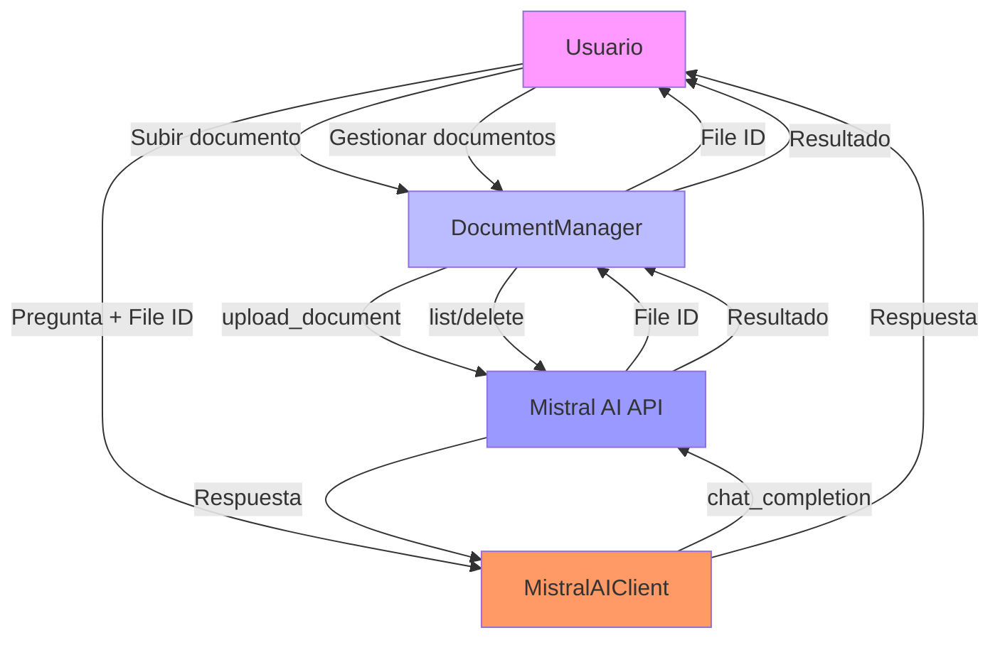

# 📄 Guía Completa de Document QnA

## 🎯 ¿Qué es Document QnA?

Document QnA (Question and Answering) es una capacidad que permite hacer preguntas en lenguaje natural sobre el contenido de documentos subidos. Combina:

- **OCR** (Optical Character Recognition) para extraer texto de documentos
- **Modelos de lenguaje** para comprender y responder preguntas
- **Gestión de archivos** para manejar documentos subidos

## 📋 Flujo de Trabajo de Document QnA



## 🚀 Implementación Paso a Paso

### 1. Configuración Inicial

```python
from dotenv import load_dotenv
from document_manager import DocumentManager
from mistral_client import MistralAIClient

# Cargar variables de entorno
load_dotenv()
api_key = os.getenv("MISTRAL_AI_API_KEY")

# Inicializar clientes
doc_manager = DocumentManager(api_key)
mistral_client = MistralAIClient(api_key)
```

### 2. Subida de Documentos

```python
# Subir un documento PDF
file_info = doc_manager.upload_document(
    file_path="report.pdf",
    purpose="ocr"  # Propósito para Document QnA
)

print(f"Document uploaded: {file_info.filename}")
print(f"File ID: {file_info.id}")
print(f"Size: {file_info.bytes} bytes")
```

**Parámetros de subida:**
- `file_path`: Ruta al archivo
- `purpose`: "ocr" (para Document QnA), "fine-tune", o "batch"

**Validaciones:**
- Archivo existe
- Tamaño máximo: 512MB
- Formatos soportados: PDF, imágenes, texto

### 3. Hacer Preguntas sobre el Documento

```python
# Crear mensajes con referencia al documento
messages = [
    {
        "role": "user",
        "content": [
            {"type": "text", "text": "What is the main topic of this document?"},
            {"type": "file", "file_id": file_info.id}  # Referencia al documento
        ]
    }
]

# Obtener respuesta
response = mistral_client.chat_completion(
    messages=messages,
    temperature=0.3,  # Baja temperatura para respuestas precisas
    determinism_level=3  # Nivel balanceado
)

print(f"Answer: {response}")
```

**Tipos de contenido soportados:**
- `text`: Texto de la pregunta
- `file`: ID de archivo subido (recomendado)
- `file_id`: ID de archivo (legacy, aún soportado)
- `document_url`: URL pública de documento
- `image_url`: URL de imagen

### 4. Múltiples Preguntas

```python
questions = [
    "What is the main topic of this annual report?",
    "What are the key financial highlights mentioned?",
    "Who is the CEO mentioned in this report?",
    "What year does this report cover?"
]

for question in questions:
    print(f"\nQuestion: {question}")
    
    messages = [
        {
            "role": "user",
            "content": [
                {"type": "text", "text": question},
                {"type": "file", "file_id": file_info.id}
            ]
        }
    ]
    
    try:
        answer = mistral_client.chat_completion(messages)
        print(f"Answer: {answer}")
    except Exception as e:
        print(f"Error: {e}")
```

### 5. Gestión de Documentos

```python
# Listar todos los documentos
documents = doc_manager.list_documents()

print("Uploaded documents:")
for doc in documents.data:
    print(f"- {doc.filename} (ID: {doc.id}, Purpose: {doc.purpose})")

# Obtener información de un documento
doc_info = doc_manager.get_document_info(file_info.id)
print(f"\nDocument info:")
print(f"  Filename: {doc_info.filename}")
print(f"  Size: {doc_info.bytes} bytes")
print(f"  Created: {doc_info.created_at}")
print(f"  Purpose: {doc_info.purpose}")

# Eliminar documento
if doc_manager.delete_document(file_info.id):
    print("\nDocument deleted successfully")
```

## 📊 Ejemplo Completo con Documento Real

```python
import os
from dotenv import load_dotenv
from document_manager import DocumentManager
from mistral_client import MistralAIClient

def main():
    # Configuración
    load_dotenv()
    api_key = os.getenv("MISTRAL_AI_API_KEY")
    
    if not api_key:
        print("Error: API key not found")
        return
    
    # Inicializar clientes
    doc_manager = DocumentManager(api_key)
    mistral_client = MistralAIClient(api_key)
    
    # Subir documento
    print("📁 Uploading document...")
    try:
        file_info = doc_manager.upload_document(
            "test_docs/edc-2024-annual-report.pdf",
            purpose="ocr"
        )
        print(f"✅ Document uploaded: {file_info.filename}")
    except Exception as e:
        print(f"❌ Failed to upload: {e}")
        return
    
    # Preguntas sobre el documento
    questions = [
        "What is the main topic of this annual report?",
        "What are the key financial highlights mentioned?",
        "Who is the CEO or leadership mentioned in this report?",
        "What year does this report cover?"
    ]
    
    print("\n💬 Asking questions about the document...")
    for question in questions:
        print(f"\n🔍 Question: {question}")
        
        messages = [
            {
                "role": "user",
                "content": [
                    {"type": "text", "text": question},
                    {"type": "file", "file_id": file_info.id}
                ]
            }
        ]
        
        try:
            answer = mistral_client.chat_completion(
                messages=messages,
                temperature=0.3,
                determinism_level=3
            )
            print(f"💡 Answer: {answer}")
        except Exception as e:
            print(f"❌ Error: {e}")
    
    # Limpiar
    print("\n🧹 Cleaning up...")
    if doc_manager.delete_document(file_info.id):
        print("✅ Document deleted successfully")

if __name__ == "__main__":
    main()
```

## 📚 Tipos de Documentos Soportados

### 1. Archivos PDF

- **Tamaño máximo**: 512MB
- **Páginas**: Hasta 2000 páginas (depende del contenido)
- **Formato**: PDF estándar (no PDF escaneados como imágenes)
- **Ejemplo**: Informes anuales, artículos científicos, documentos técnicos

### 2. Imágenes

- **Formatos**: JPEG, PNG, GIF
- **Tamaño máximo**: 20MB
- **Resolución**: Hasta 4096x4096 píxeles
- **Ejemplo**: Diagramas, gráficos, infografías

### 3. Texto Plano

- **Formatos**: TXT, MD, CSV
- **Tamaño máximo**: 512MB
- **Ejemplo**: Archivos de registro, datos estructurados

### 4. Otros Formatios

- **HTML**: Páginas web
- **JSON**: Datos estructurados
- **XML**: Datos estructurados

## 🎛️ Optimización de Parámetros

### Temperatura

| Valor | Efecto | Uso Recomendado |
|-------|--------|-----------------|
| 0.1-0.3 | Respuestas precisas | Document QnA, datos factuales |
| 0.5-0.7 | Equilibrio | Uso general, conversaciones |
| 0.8-1.0 | Respuestas creativas | Generación de contenido |

### Nivel de Determinismo

| Nivel | Uso en Document QnA |
|-------|---------------------|
| 1 | Extracción de datos exactos |
| 2 | Análisis técnico detallado |
| 3 | Respuestas balanceadas (recomendado) |
| 4 | Interpretación creativa |
| 5 | Insights innovadores |

### Ejemplo de Optimización

```python
# Para extracción de datos exactos
client = MistralAIClient(
    api_key=api_key,
    determinism_level=1,  # Exacto
    model="mistral-small-latest"  # Modelo preciso
)

# Para análisis balanceado
client = MistralAIClient(
    api_key=api_key,
    determinism_level=3,  # Balanceado
    model="mistral-medium-latest"  # Modelo equilibrado
)

# Para insights creativos
client = MistralAIClient(
    api_key=api_key,
    determinism_level=4,  # Creativo
    model="mistral-large-latest"  # Modelo potente
)
```

## 🔍 Casos de Uso Avanzados

### 1. Análisis de Informes Anuales

```python
# Subir informe anual
file_info = doc_manager.upload_document("annual_report_2024.pdf", purpose="ocr")

# Preguntas financieras
financial_questions = [
    "What was the total revenue in 2024?",
    "What was the net income compared to 2023?",
    "What were the key financial ratios?",
    "What investments were mentioned?"
]

for question in financial_questions:
    messages = [
        {
            "role": "user",
            "content": [
                {"type": "text", "text": question},
                {"type": "file", "file_id": file_info.id}
            ]
        }
    ]
    
    # Usar nivel 1 para precisión financiera
    answer = mistral_client.chat_completion(
        messages,
        determinism_level=1
    )
    print(f"Q: {question}")
    print(f"A: {answer}\n")
```

### 2. Extracción de Información Técnica

```python
# Subir artículo científico
file_info = doc_manager.upload_document("research_paper.pdf", purpose="ocr")

# Preguntas técnicas
technical_questions = [
    "What is the main hypothesis?",
    "What methodology was used?",
    "What were the key findings?",
    "What limitations were mentioned?"
]

for question in technical_questions:
    messages = [
        {
            "role": "user",
            "content": [
                {"type": "text", "text": question},
                {"type": "file", "file_id": file_info.id}
            ]
        }
    ]
    
    # Usar nivel 2 para análisis técnico
    answer = mistral_client.chat_completion(
        messages,
        determinism_level=2
    )
    print(f"Q: {question}")
    print(f"A: {answer}\n")
```

### 3. Generación de Resúmenes

```python
# Subir documento largo
file_info = doc_manager.upload_document("long_report.pdf", purpose="ocr")

# Solicitar resumen
summary_prompt = "Provide a comprehensive summary of this document in 5 key points."

messages = [
    {
        "role": "user",
        "content": [
            {"type": "text", "text": summary_prompt},
            {"type": "file", "file_id": file_info.id}
        ]
    }
]

# Usar nivel 3 para resumen balanceado
summary = mistral_client.chat_completion(
    messages,
    determinism_level=3
)

print("Summary:")
print(summary)
```

### 4. Comparación de Múltiples Documentos

```python
# Subir múltiples documentos
doc1 = doc_manager.upload_document("report_2023.pdf", purpose="ocr")
doc2 = doc_manager.upload_document("report_2024.pdf", purpose="ocr")

# Preguntas comparativas
comparison_questions = [
    "What are the key differences between 2023 and 2024 reports?",
    "How did financial performance change?",
    "What new initiatives were introduced in 2024?"
]

for question in comparison_questions:
    messages = [
        {
            "role": "user",
            "content": [
                {"type": "text", "text": question},
                {"type": "file", "file_id": doc1.id},
                {"type": "file", "file_id": doc2.id}
            ]
        }
    ]
    
    # Usar nivel 4 para análisis comparativo
    answer = mistral_client.chat_completion(
        messages,
        determinism_level=4
    )
    print(f"Q: {question}")
    print(f"A: {answer}\n")
```

## 📊 Manejo de Errores

### Errores Comunes y Soluciones

| Error | Causa | Solución |
|-------|-------|----------|
| FileNotFoundError | Archivo no existe | Verificar ruta del archivo |
| ValueError (size) | Archivo > 512MB | Usar archivo más pequeño |
| ValueError (purpose) | Propósito inválido | Usar "ocr", "fine-tune", o "batch" |
| RuntimeError (upload) | Error de API | Verificar conexión y API key |
| RuntimeError (QnA) | Formato inválido | Verificar formato de mensajes |
| 404 Not Found | Archivo no encontrado | Verificar file_id |
| 429 Too Many Requests | Límite de tasa | Implementar retry con backoff |

### Implementación de Manejo de Errores

```python
try:
    # Subir documento
    file_info = doc_manager.upload_document("report.pdf", purpose="ocr")
    
    # Hacer pregunta
    messages = [
        {
            "role": "user",
            "content": [
                {"type": "text", "text": "What is the main topic?"},
                {"type": "file", "file_id": file_info.id}
            ]
        }
    ]
    
    response = mistral_client.chat_completion(messages)
    print(f"Answer: {response}")
    
    # Limpiar
    doc_manager.delete_document(file_info.id)
    
except FileNotFoundError as e:
    print(f"File error: {e}")
except ValueError as e:
    print(f"Validation error: {e}")
except RuntimeError as e:
    print(f"API error: {e}")
except Exception as e:
    print(f"Unexpected error: {e}")
    # Intentar limpieza
    try:
        if 'file_info' in locals():
            doc_manager.delete_document(file_info.id)
    except:
        pass
```

## 🛡️ Seguridad y Privacidad

### Buenas Prácticas

1. **Manejo de API Key**:
   - Nunca en código fuente
   - Usar variables de entorno
   - Rotación periódica

2. **Documentos Sensibles**:
   - Eliminar después de usar
   - No almacenar innecesariamente
   - Usar URLs firmadas para acceso temporal

3. **Validación de Entrada**:
   - Validar tipos de archivo
   - Limitar tamaño de archivos
   - Escanear contenido si es necesario

### Ejemplo de Seguridad

```python
# Validar archivo antes de subir
def validate_document(file_path):
    # Verificar existencia
    if not os.path.exists(file_path):
        raise FileNotFoundError(f"File {file_path} not found")
    
    # Verificar tamaño
    file_size = os.path.getsize(file_path)
    if file_size > 512 * 1024 * 1024:  # 512MB
        raise ValueError(f"File too large: {file_size} bytes")
    
    # Verificar extensión
    if not file_path.lower().endswith(('.pdf', '.png', '.jpg', '.jpeg', '.txt')):
        raise ValueError(f"Unsupported file type: {file_path}")
    
    return True

# Uso
try:
    validate_document("report.pdf")
    file_info = doc_manager.upload_document("report.pdf", purpose="ocr")
    # ... resto del código
except Exception as e:
    print(f"Validation failed: {e}")
```

## 📈 Optimización de Rendimiento

### 1. Cache de Respuestas

```python
from functools import lru_cache

@lru_cache(maxsize=100)
def cached_document_qna(file_id, question):
    messages = [
        {
            "role": "user",
            "content": [
                {"type": "text", "text": question},
                {"type": "file", "file_id": file_id}
            ]
        }
    ]
    
    return mistral_client.chat_completion(messages)

# Uso
file_info = doc_manager.upload_document("report.pdf", purpose="ocr")
answer = cached_document_qna(file_info.id, "What is the main topic?")
```

### 2. Procesamiento por Lotes

```python
def batch_document_qna(file_id, questions):
    results = {}
    
    for question in questions:
        messages = [
            {
                "role": "user",
                "content": [
                    {"type": "text", "text": question},
                    {"type": "file", "file_id": file_id}
                ]
            }
        ]
        
        results[question] = mistral_client.chat_completion(messages)
    
    return results

# Uso
file_info = doc_manager.upload_document("report.pdf", purpose="ocr")
questions = ["Q1", "Q2", "Q3"]
answers = batch_document_qna(file_info.id, questions)
```

### 3. Streaming para Documentos Grandes

```python
def stream_document_qna(file_id, question):
    messages = [
        {
            "role": "user",
            "content": [
                {"type": "text", "text": question},
                {"type": "file", "file_id": file_id}
            ]
        }
    ]
    
    print(f"Question: {question}")
    print("Answer:")
    
    for chunk in mistral_client.chat_completion_stream(messages):
        print(chunk, end="", flush=True)
    
    print()

# Uso
file_info = doc_manager.upload_document("large_report.pdf", purpose="ocr")
stream_document_qna(file_info.id, "Summarize this document")
```

## 📚 Recursos Adicionales

- [Documentación de Mistral AI Files API](https://docs.mistral.ai/api/endpoint/files)
- [Documentación de Chat Completions](https://docs.mistral.ai/api/endpoint/chat)
- [Guía de Document QnA](https://docs.mistral.ai/capabilities/document_ai/document_qna)
- [Cookbook de Document Understanding](https://colab.research.google.com/github/mistralai/cookbook/blob/main/mistral/ocr/document_understanding.ipynb)

## 🎯 Conclusión

Document QnA es una herramienta poderosa para:

- ✅ **Extraer información**: De documentos PDF, informes, artículos
- ✅ **Analizar contenido**: Financiero, técnico, legal
- ✅ **Generar insights**: Resúmenes, comparaciones, análisis
- ✅ **Automatizar procesos**: Procesamiento de documentos a escala

**Recomendaciones finales:**

1. Empieza con `mistral-small-latest` y nivel 3 para equilibrio
2. Usa nivel 1-2 para extracción de datos precisos
3. Usa nivel 4-5 para análisis creativo
4. Limpia documentos después de usar
5. Monitorea el uso de tokens y costo
6. Experimenta con diferentes modelos y niveles

Esta guía proporciona todo lo necesario para implementar Document QnA de manera efectiva con Mistral AI.