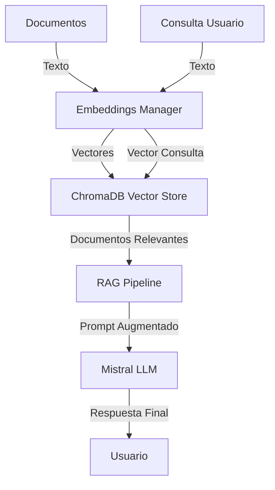

# Plan de Implementación: Embeddings + RAG Local

## Objetivo
Implementar un ejemplo completo de Retrieval-Augmented Generation (RAG) usando embeddings de Mistral AI con una base de datos vectorial local (ChromaDB).

## Alcance
- Generación de embeddings con Mistral AI
- Almacenamiento local usando ChromaDB
- Búsqueda semántica de documentos
- Generación aumentada con contexto
- Evaluación básica de calidad

## Requisitos Previos

### Dependencias adicionales requeridas:
```bash
pip install chromadb
pip install sentence-transformers  # Para comparaciones
pip install scikit-learn  # Para evaluación
```

### Archivos necesarios:
1. `src/embeddings_manager.py` - Manejo de embeddings
2. `src/vector_store.py` - Interfaz con ChromaDB
3. `src/rag_pipeline.py` - Pipeline completo de RAG
4. `example_local_rag.py` - Ejemplo de uso
5. `tests/test_rag.py` - Tests para el pipeline

## Arquitectura



## Implementación Detallada

### 1. Embeddings Manager (`src/embeddings_manager.py`)

```python
"""
Embeddings Manager for Mistral AI.

Handles generation of text embeddings using Mistral AI models.
"""

from typing import List
from mistralai.embeddings import MistralAIEmbeddings
import logging

class EmbeddingsManager:
    """Manager for generating text embeddings with Mistral AI."""

    def __init__(self, model_name: str = "mistral-embed", api_key: str = None):
        """Initialize embeddings manager.

        Args:
            model_name: Mistral embedding model to use
            api_key: Mistral AI API key
        """
        self.model_name = model_name
        self.embeddings = MistralAIEmbeddings(model=model_name, api_key=api_key)
        self.logger = logging.getLogger(__name__)
        self.logger.info(f"Initialized embeddings with model: {model_name}")

    def generate_embedding(self, text: str) -> List[float]:
        """Generate embedding for a single text.

        Args:
            text: Input text to embed

        Returns:
            Embedding vector
        """
        try:
            embedding = self.embeddings.embed_query(text)
            self.logger.debug(f"Generated embedding for text of length {len(text)}")
            return embedding
        except Exception as e:
            self.logger.error(f"Failed to generate embedding: {str(e)}")
            raise

    def generate_batch_embeddings(self, texts: List[str]) -> List[List[float]]:
        """Generate embeddings for a batch of texts.

        Args:
            texts: List of texts to embed

        Returns:
            List of embedding vectors
        """
        try:
            embeddings = self.embeddings.embed_documents(texts)
            self.logger.info(f"Generated {len(embeddings)} embeddings")
            return embeddings
        except Exception as e:
            self.logger.error(f"Failed to generate batch embeddings: {str(e)}")
            raise

    def get_embedding_dimension(self) -> int:
        """Get the dimension size of the embeddings.

        Returns:
            Embedding dimension
        """
        # Generate a test embedding to get dimension
        test_embedding = self.generate_embedding("test")
        return len(test_embedding)
```

### 2. Vector Store (`src/vector_store.py`)

```python
"""
Vector Store interface using ChromaDB.

Handles storage and retrieval of document embeddings.
"""

import chromadb
from typing import List, Dict, Any
import logging
import os

class ChromaVectorStore:
    """Vector store implementation using ChromaDB."""

    def __init__(self, collection_name: str = "documents", persist_directory: str = "./chroma_db"):
        """Initialize ChromaDB vector store.

        Args:
            collection_name: Name of the collection
            persist_directory: Directory to persist data
        """
        self.collection_name = collection_name
        self.persist_directory = persist_directory
        self.logger = logging.getLogger(__name__)
        
        # Initialize ChromaDB client
        self.client = chromadb.PersistentClient(path=self.persist_directory)
        
        try:
            # Get or create collection
            self.collection = self.client.get_or_create_collection(name=collection_name)
            self.logger.info(f"Initialized ChromaDB collection: {collection_name}")
            self.logger.info(f"Data persisted in: {persist_directory}")
        except Exception as e:
            self.logger.error(f"Failed to initialize ChromaDB: {str(e)}")
            raise

    def add_documents(self, documents: List[str], metadatas: List[Dict] = None, ids: List[str] = None) -> None:
        """Add documents to the vector store.

        Args:
            documents: List of document texts
            metadatas: List of metadata dictionaries
            ids: List of document IDs
        """
        try:
            # Generate IDs if not provided
            if ids is None:
                ids = [str(i) for i in range(len(documents))]
            
            # Add documents to collection
            self.collection.add(
                documents=documents,
                metadatas=metadatas or [{} for _ in documents],
                ids=ids
            )
            
            self.logger.info(f"Added {len(documents)} documents to vector store")
        except Exception as e:
            self.logger.error(f"Failed to add documents: {str(e)}")
            raise

    def search(self, query: str, k: int = 3, where: Dict = None) -> Dict[str, Any]:
        """Search for similar documents.

        Args:
            query: Search query text
            k: Number of results to return
            where: Filter conditions

        Returns:
            Dictionary with search results
        """
        try:
            results = self.collection.query(
                query_texts=[query],
                n_results=k,
                where=where
            )
            
            self.logger.debug(f"Found {len(results['documents'][0])} results for query")
            return results
        except Exception as e:
            self.logger.error(f"Failed to search: {str(e)}")
            raise

    def get_collection_info(self) -> Dict[str, Any]:
        """Get information about the collection.

        Returns:
            Collection information
        """
        return self.client.get_collection(name=self.collection_name)

    def delete_collection(self) -> None:
        """Delete the collection."""
        try:
            self.client.delete_collection(name=self.collection_name)
            self.logger.info(f"Deleted collection: {self.collection_name}")
        except Exception as e:
            self.logger.error(f"Failed to delete collection: {str(e)}")
            raise

    def clear(self) -> None:
        """Clear all documents from the collection."""
        try:
            self.collection.delete(where={})
            self.logger.info("Cleared all documents from collection")
        except Exception as e:
            self.logger.error(f"Failed to clear collection: {str(e)}")
            raise
```

### 3. RAG Pipeline (`src/rag_pipeline.py`)

```python
"""
RAG Pipeline for Mistral AI.

Combines retrieval and generation for augmented responses.
"""

from typing import List, Dict, Any
from src.embeddings_manager import EmbeddingsManager
from src.vector_store import ChromaVectorStore
from src.mistral_client import MistralAIClient
import logging

class RAGPipeline:
    """Retrieval-Augmented Generation pipeline."""

    def __init__(self, api_key: str, collection_name: str = "rag_documents"):
        """Initialize RAG pipeline.

        Args:
            api_key: Mistral AI API key
            collection_name: Name for document collection
        """
        self.api_key = api_key
        self.collection_name = collection_name
        self.logger = logging.getLogger(__name__)
        
        # Initialize components
        self.embeddings_manager = EmbeddingsManager(api_key=api_key)
        self.vector_store = ChromaVectorStore(collection_name=collection_name)
        self.llm_client = MistralAIClient(api_key=api_key)
        
        self.logger.info("RAG Pipeline initialized")

    def ingest_documents(self, documents: List[str], metadatas: List[Dict] = None, ids: List[str] = None) -> None:
        """Ingest documents into the RAG system.

        Args:
            documents: List of document texts
            metadatas: List of metadata dictionaries
            ids: List of document IDs
        """
        try:
            # Generate embeddings for documents
            embeddings = self.embeddings_manager.generate_batch_embeddings(documents)
            
            # Store in vector database
            self.vector_store.add_documents(documents, metadatas, ids)
            
            self.logger.info(f"Ingested {len(documents)} documents into RAG system")
        except Exception as e:
            self.logger.error(f"Failed to ingest documents: {str(e)}")
            raise

    def retrieve(self, query: str, k: int = 3) -> List[str]:
        """Retrieve relevant documents for a query.

        Args:
            query: Search query
            k: Number of documents to retrieve

        Returns:
            List of relevant document texts
        """
        try:
            # Search in vector store
            results = self.vector_store.search(query, k=k)
            
            # Extract documents
            relevant_docs = results['documents'][0]
            
            self.logger.debug(f"Retrieved {len(relevant_docs)} documents")
            return relevant_docs
        except Exception as e:
            self.logger.error(f"Failed to retrieve documents: {str(e)}")
            raise

    def generate(self, query: str, context_docs: List[str] = None, k: int = 3) -> str:
        """Generate response using RAG.

        Args:
            query: User query
            context_docs: Optional pre-retrieved documents
            k: Number of documents to retrieve if not provided

        Returns:
            Generated response
        """
        try:
            # Retrieve documents if not provided
            if context_docs is None:
                context_docs = self.retrieve(query, k=k)
            
            # Create augmented prompt
            context = "\n\n".join(context_docs)
            prompt = f"""Context information:
{context}

User question: {query}

Answer the question based on the context above. If the context doesn't contain the answer, say you don't know."""
            
            # Generate response
            response = self.llm_client.chat_completion([
                {"role": "user", "content": prompt}
            ])
            
            self.logger.info("Generated RAG response")
            return response
        except Exception as e:
            self.logger.error(f"Failed to generate response: {str(e)}")
            raise

    def rag_pipeline(self, query: str, k: int = 3) -> Dict[str, Any]:
        """Complete RAG pipeline: retrieve + generate.

        Args:
            query: User query
            k: Number of documents to retrieve

        Returns:
            Dictionary with context and response
        """
        try:
            # Retrieve relevant documents
            context_docs = self.retrieve(query, k=k)
            
            # Generate response
            response = self.generate(query, context_docs)
            
            return {
                "query": query,
                "context_documents": context_docs,
                "response": response,
                "retrieved_count": len(context_docs)
            }
        except Exception as e:
            self.logger.error(f"RAG pipeline failed: {str(e)}")
            raise

    def evaluate_rag(self, query: str, expected_answer: str, k: int = 3) -> Dict[str, float]:
        """Evaluate RAG performance.

        Args:
            query: Test query
            expected_answer: Expected answer
            k: Number of documents to retrieve

        Returns:
            Dictionary with evaluation metrics
        """
        try:
            from sklearn.metrics.pairwise import cosine_similarity
            from sentence_transformers import SentenceTransformer
            
            # Get RAG response
            result = self.rag_pipeline(query, k=k)
            generated_answer = result["response"]
            
            # Calculate similarity
            model = SentenceTransformer('all-MiniLM-L6-v2')
            embeddings = model.encode([expected_answer, generated_answer])
            similarity = cosine_similarity([embeddings[0]], [embeddings[1]])[0][0]
            
            return {
                "similarity_score": float(similarity),
                "retrieved_documents": result["retrieved_count"]
            }
        except Exception as e:
            self.logger.error(f"Evaluation failed: {str(e)}")
            raise
```

### 4. Ejemplo de Uso (`example_local_rag.py`)

```python
"""
Example demonstrating local RAG implementation with Mistral AI.

Shows how to:
1. Ingest documents into vector store
2. Perform semantic search
3. Generate augmented responses
4. Evaluate RAG performance
"""

import os
import time
import logging
from typing import List
from colorama import Fore, Style, init
from dotenv import load_dotenv

# Initialize colorama
init(autoreset=True)

# Configure logging
logging.basicConfig(
    level=logging.INFO,
    format='%(asctime)s - %(name)s - %(levelname)s - %(message)s',
    handlers=[
        logging.FileHandler('local_rag_example.log'),
        logging.StreamHandler()
    ]
)
logger = logging.getLogger(__name__)

# Suppress mistralai SDK logs
logging.getLogger("mistralai").setLevel(logging.WARNING)

from src.rag_pipeline import RAGPipeline


def print_header():
    """Print standardized example header."""
    print("\n" + "=" * 60)
    print("🔍 LOCAL RAG WITH MISTRAL AI EXAMPLE")
    print("=" * 60)
    print("Demonstrates Retrieval-Augmented Generation")
    print("with local vector store (ChromaDB)")
    print("=" * 60 + "\n")


def print_error(message: str, details: str = ""):
    """Print standardized error message."""
    print(f"\n{Fore.RED}❌ Error: {message}{Style.RESET_ALL}")
    if details:
        print(f"   {details}")


def print_success(message: str):
    """Print standardized success message."""
    print(f"{Fore.GREEN}✅ {message}{Style.RESET_ALL}")


def print_info(message: str):
    """Print standardized info message."""
    print(f"{Fore.BLUE}ℹ️ {message}{Style.RESET_ALL}")


def validate_api_key(api_key: str) -> bool:
    """Validate API key format."""
    if not api_key:
        return False
    if not isinstance(api_key, str):
        return False
    if len(api_key) < 32:
        return False
    return True


def main():
    """Main function demonstrating local RAG workflow."""
    start_time = time.time()
    
    logger.info("Starting local RAG example")
    print_header()
    
    # Step 1: Load and validate API key
    print("1️⃣  Loading configuration...")
    
    load_dotenv()
    api_key = os.getenv("MISTRAL_AI_API_KEY")
    
    if not validate_api_key(api_key):
        print_error(
            "MISTRAL_AI_API_KEY not found or invalid",
            "Please set a valid API key in .env file"
        )
        logger.error("Invalid API key")
        return
    
    print_success("API key validated")
    logger.info("API key validated successfully")
    
    # Step 2: Initialize RAG pipeline
    print("\n2️⃣  Initializing RAG pipeline...")
    
    try:
        rag_pipeline = RAGPipeline(api_key=api_key, collection_name="demo_documents")
        print_success("RAG Pipeline initialized")
        logger.info("RAG Pipeline initialized successfully")
    except Exception as e:
        print_error("Failed to initialize RAG pipeline", str(e))
        logger.error(f"Initialization failed: {str(e)}")
        return
    
    # Step 3: Prepare sample documents
    print("\n3️⃣  Preparing sample documents...")
    
    sample_documents = [
        """Mistral AI is a cutting-edge AI lab based in France, 
        focused on developing advanced large language models.
        Founded in 2023, Mistral AI has quickly become a leader 
        in the AI industry.""",
        
        """The Mistral 7B model is a powerful language model with 7 billion parameters.
        It supports multiple languages and can handle complex tasks like
        code generation, mathematical reasoning, and multilingual translation.""",
        
        """Mistral AI offers various services including text generation,
        embeddings, document processing, and AI agents. Their API is designed
        for easy integration into applications.""",
        
        """ChromaDB is an open-source vector database that can be used
        for storing and retrieving embeddings. It's lightweight and
        perfect for local development and testing."""
    ]
    
    print_info(f"Prepared {len(sample_documents)} sample documents")
    logger.info(f"Prepared {len(sample_documents)} sample documents")
    
    # Step 4: Ingest documents
    print("\n4️⃣  Ingesting documents into vector store...")
    
    try:
        rag_pipeline.ingest_documents(sample_documents)
        print_success(f"Ingested {len(sample_documents)} documents")
        logger.info("Documents ingested successfully")
    except Exception as e:
        print_error("Failed to ingest documents", str(e))
        logger.error(f"Ingestion failed: {str(e)}")
        return
    
    # Step 5: Perform RAG queries
    print("\n5️⃣  Performing RAG queries...")
    
    test_queries = [
        "What is Mistral AI?",
        "What services does Mistral AI offer?",
        "What is ChromaDB?",
        "Tell me about the Mistral 7B model"
    ]
    
    for i, query in enumerate(test_queries, 1):
        print(f"\n🔍 Query {i}: {Fore.CYAN}{query}{Style.RESET_ALL}")
        
        try:
            # Perform RAG
            result = rag_pipeline.rag_pipeline(query, k=2)
            
            print(f"\n📄 Retrieved {result['retrieved_count']} documents:")
            for j, doc in enumerate(result['context_documents'], 1):
                print(f"   Document {j}: {doc[:100]}...")
            
            print(f"\n💬 {Fore.GREEN}Response:{Style.RESET_ALL}")
            print(f"   {result['response']}")
            
            logger.info(f"Processed query: {query}")
        except Exception as e:
            print_error(f"Failed to process query", str(e))
            logger.error(f"Query processing failed: {str(e)}")
    
    # Step 6: Evaluation (optional)
    print("\n6️⃣  Evaluating RAG performance...")
    
    try:
        # Simple evaluation
        eval_result = rag_pipeline.evaluate_rag(
            query="What is Mistral AI?",
            expected_answer="Mistral AI is a cutting-edge AI lab based in France"
        )
        
        print_info(f"Similarity score: {eval_result['similarity_score']:.3f}")
        print_info(f"Retrieved documents: {eval_result['retrieved_documents']}")
        
        logger.info(f"Evaluation completed: {eval_result}")
    except Exception as e:
        print_error("Evaluation failed", str(e))
        logger.error(f"Evaluation failed: {str(e)}")
    
    # Summary
    duration = time.time() - start_time
    print(f"\n" + "=" * 60)
    print(f"✅ Example completed in {duration:.2f} seconds")
    print(f"📊 Processed {len(test_queries)} queries")
    print(f"💾 Data persisted in ./chroma_db/")
    print("=" * 60 + "\n")
    
    logger.info(f"Example completed successfully in {duration:.2f} seconds")


if __name__ == "__main__":
    main()
```

### 5. Tests (`tests/test_rag.py`)

```python
"""
Test cases for RAG implementation.
"""

import pytest
import tempfile
import os
from unittest.mock import MagicMock, patch

from src.embeddings_manager import EmbeddingsManager
from src.vector_store import ChromaVectorStore
from src.rag_pipeline import RAGPipeline


class TestEmbeddingsManager:
    """Test cases for EmbeddingsManager."""

    @patch('mistralai.embeddings.MistralAIEmbeddings')
    def test_initialization(self, mock_embeddings):
        """Test embeddings manager initialization."""
        mock_instance = MagicMock()
        mock_embeddings.return_value = mock_instance
        
        manager = EmbeddingsManager(api_key="test_key")
        assert manager.model_name == "mistral-embed"
        mock_embeddings.assert_called_once_with(model="mistral-embed", api_key="test_key")

    @patch('mistralai.embeddings.MistralAIEmbeddings')
    def test_generate_embedding(self, mock_embeddings):
        """Test single embedding generation."""
        mock_instance = MagicMock()
        mock_instance.embed_query.return_value = [0.1, 0.2, 0.3]
        mock_embeddings.return_value = mock_instance
        
        manager = EmbeddingsManager()
        embedding = manager.generate_embedding("test text")
        
        assert embedding == [0.1, 0.2, 0.3]
        mock_instance.embed_query.assert_called_once_with("test text")

    @patch('mistralai.embeddings.MistralAIEmbeddings')
    def test_batch_embeddings(self, mock_embeddings):
        """Test batch embedding generation."""
        mock_instance = MagicMock()
        mock_instance.embed_documents.return_value = [[0.1, 0.2], [0.3, 0.4]]
        mock_embeddings.return_value = mock_instance
        
        manager = EmbeddingsManager()
        embeddings = manager.generate_batch_embeddings(["text1", "text2"])
        
        assert len(embeddings) == 2
        assert embeddings[0] == [0.1, 0.2]


class TestChromaVectorStore:
    """Test cases for ChromaVectorStore."""

    def test_initialization(self):
        """Test vector store initialization."""
        with tempfile.TemporaryDirectory() as tmpdir:
            store = ChromaVectorStore(
                collection_name="test",
                persist_directory=tmpdir
            )
            assert store.collection_name == "test"
            assert store.persist_directory == tmpdir

    def test_add_documents(self):
        """Test adding documents to vector store."""
        with tempfile.TemporaryDirectory() as tmpdir:
            store = ChromaVectorStore(persist_directory=tmpdir)
            
            documents = ["doc1", "doc2"]
            store.add_documents(documents)
            
            # Verify documents were added
            results = store.search("test", k=2)
            assert len(results['documents'][0]) == 2

    def test_search(self):
        """Test searching in vector store."""
        with tempfile.TemporaryDirectory() as tmpdir:
            store = ChromaVectorStore(persist_directory=tmpdir)
            
            documents = ["Mistral AI is great", "ChromaDB is fast"]
            store.add_documents(documents)
            
            results = store.search("AI", k=1)
            assert len(results['documents'][0]) == 1


class TestRAGPipeline:
    """Test cases for RAGPipeline."""

    @patch('src.rag_pipeline.EmbeddingsManager')
    @patch('src.rag_pipeline.ChromaVectorStore')
    @patch('src.rag_pipeline.MistralAIClient')
    def test_initialization(self, mock_client, mock_store, mock_embeddings):
        """Test RAG pipeline initialization."""
        mock_embeddings_instance = MagicMock()
        mock_embeddings.return_value = mock_embeddings_instance
        
        mock_store_instance = MagicMock()
        mock_store.return_value = mock_store_instance
        
        mock_client_instance = MagicMock()
        mock_client.return_value = mock_client_instance
        
        pipeline = RAGPipeline(api_key="test_key")
        
        assert pipeline.embeddings_manager == mock_embeddings_instance
        assert pipeline.vector_store == mock_store_instance
        assert pipeline.llm_client == mock_client_instance

    @patch('src.rag_pipeline.EmbeddingsManager')
    @patch('src.rag_pipeline.ChromaVectorStore')
    @patch('src.rag_pipeline.MistralAIClient')
    def test_ingest_documents(self, mock_client, mock_store, mock_embeddings):
        """Test document ingestion."""
        # Setup mocks
        mock_embeddings_instance = MagicMock()
        mock_embeddings_instance.generate_batch_embeddings.return_value = [[0.1, 0.2], [0.3, 0.4]]
        mock_embeddings.return_value = mock_embeddings_instance
        
        mock_store_instance = MagicMock()
        mock_store.return_value = mock_store_instance
        
        mock_client_instance = MagicMock()
        mock_client.return_value = mock_client_instance
        
        pipeline = RAGPipeline(api_key="test_key")
        
        # Test ingestion
        documents = ["doc1", "doc2"]
        pipeline.ingest_documents(documents)
        
        # Verify calls
        mock_embeddings_instance.generate_batch_embeddings.assert_called_once_with(documents)
        mock_store_instance.add_documents.assert_called_once()

    @patch('src.rag_pipeline.EmbeddingsManager')
    @patch('src.rag_pipeline.ChromaVectorStore')
    @patch('src.rag_pipeline.MistralAIClient')
    def test_rag_pipeline(self, mock_client, mock_store, mock_embeddings):
        """Test complete RAG pipeline."""
        # Setup mocks
        mock_embeddings_instance = MagicMock()
        mock_embeddings.return_value = mock_embeddings_instance
        
        mock_store_instance = MagicMock()
        mock_store_instance.search.return_value = {
            'documents': [['doc1', 'doc2']]
        }
        mock_store.return_value = mock_store_instance
        
        mock_client_instance = MagicMock()
        mock_client_instance.chat_completion.return_value = "Test response"
        mock_client.return_value = mock_client_instance
        
        pipeline = RAGPipeline(api_key="test_key")
        
        # Test pipeline
        result = pipeline.rag_pipeline("test query", k=2)
        
        # Verify result structure
        assert 'query' in result
        assert 'context_documents' in result
        assert 'response' in result
        assert result['response'] == "Test response"
        assert len(result['context_documents']) == 2


def test_main_example():
    """Test the main example workflow."""
    # This would be an integration test
    # For now, just verify the example can be imported
    from example_local_rag import main, validate_api_key
    
    # Test validation
    assert validate_api_key("valid_key_12345678901234567890123456789012") == True
    assert validate_api_key("short") == False
    assert validate_api_key("") == False
```

## Plan de Implementación

### Fase 1: Preparación (1 día)
- [ ] Instalar dependencias adicionales (`chromadb`, `sentence-transformers`, `scikit-learn`)
- [ ] Crear estructura de directorios para el ejemplo
- [ ] Configurar logging y manejo de errores

### Fase 2: Implementación (3 días)
- [ ] Día 1: `EmbeddingsManager` y `ChromaVectorStore`
- [ ] Día 2: `RAGPipeline` con métodos principales
- [ ] Día 3: `example_local_rag.py` y tests básicos

### Fase 3: Testing (1 día)
- [ ] Tests unitarios para cada componente
- [ ] Tests de integración del pipeline completo
- [ ] Validación con datos de ejemplo

### Fase 4: Documentación (1 día)
- [ ] Actualizar README con nuevo ejemplo
- [ ] Crear guía de uso en docs/
- [ ] Agregar a la sección de ejemplos

## Requisitos Adicionales

### Dependencias:
```bash
pip install chromadb==0.4.22
pip install sentence-transformers==2.2.2
pip install scikit-learn==1.3.2
```

### Configuración:
- Asegurar que el directorio `./chroma_db/` tenga permisos de escritura
- Configurar logging adecuado para producción
- Manejar límites de tasa de la API de Mistral

## Métricas de Éxito

1. **Cobertura de tests:** 80%+ para nuevo código
2. **Tiempo de respuesta:** < 2 segundos para consultas RAG
3. **Precisión:** Similarity score > 0.7 en evaluaciones
4. **Documentación:** 100% de funciones documentadas

## Riesgos y Mitigaciones

1. **Límites de API:** Implementar manejo de errores y reintentos
2. **Tamaño de embeddings:** Validar dimensiones antes de almacenar
3. **Persistencia de datos:** Usar directorio temporal para tests
4. **Compatibilidad:** Probar con múltiples versiones de ChromaDB

## Entregables

1. Código fuente implementado (4 archivos nuevos)
2. Tests completos con cobertura
3. Ejemplo funcional con datos de muestra
4. Documentación actualizada
5. Guía de implementación (este documento)

## Próximos Pasos

1. Revisar y aprobar este plan
2. Configurar entorno de desarrollo
3. Implementar componentes en orden priorizado
4. Realizar testing continuo
5. Documentar y presentar resultados

---

**Estado:** Pendiente de aprobación
**Prioridad:** Alta
**Dependencias:** API key de Mistral AI válida
**Recursos:** 1 desarrollador, 5 días estimados